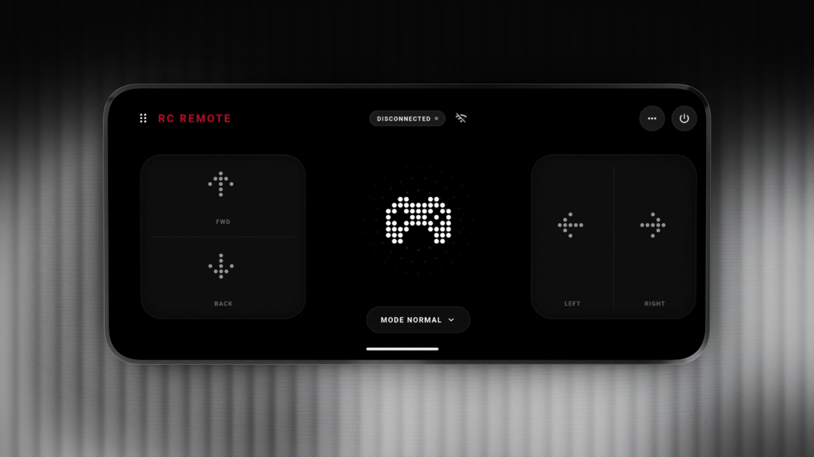

# Smart Rover RC Remote

Smart Rover is a Flutter mobile app to control a Bluetooth serial robot with manual controls, autonomous modes, and voice commands.

## What This App Does

- Connects to a Bluetooth serial device
- Sends movement commands (forward, backward, left, right, stop)
- Switches modes (manual, obstacle avoid, follow)
- Supports voice command control

## Requirements

- Flutter SDK installed
- Android phone or tablet
- USB cable for first-time run from desktop
- A Bluetooth device (you can use any Bluetooth device to check app functionality)

## Run the App

1. Install dependencies:

   flutter pub get

2. Connect your Android phone to your computer with USB.

3. Confirm Flutter can see the device:

   flutter devices

4. Start the app:

   flutter run

## Connect to Mobile and Bluetooth

1. On the phone, enable Bluetooth.
2. Pair your Bluetooth device in Android system settings first.
3. Open the Smart Rover app.
4. Grant Bluetooth, location, and microphone permissions when prompted.
5. Select the paired Bluetooth device inside the app.
6. Test D-pad, mode buttons, and voice commands.

## Functionality Check

- Use any paired Bluetooth device to confirm connection and command sending.
- Verify directional and mode actions respond as expected.
- If the target robot is not available, connection and command flow can still be validated with another Bluetooth device.

## Check Terminal Process

Keep the terminal open while running the app. Use terminal output to track build, deploy, and runtime issues.

- Standard run logs:

  flutter run

- Detailed logs when debugging connection or permissions:

  flutter run -v

## Build Release APK

flutter build apk --release
